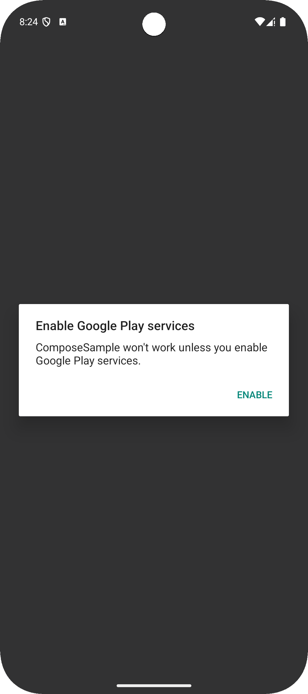
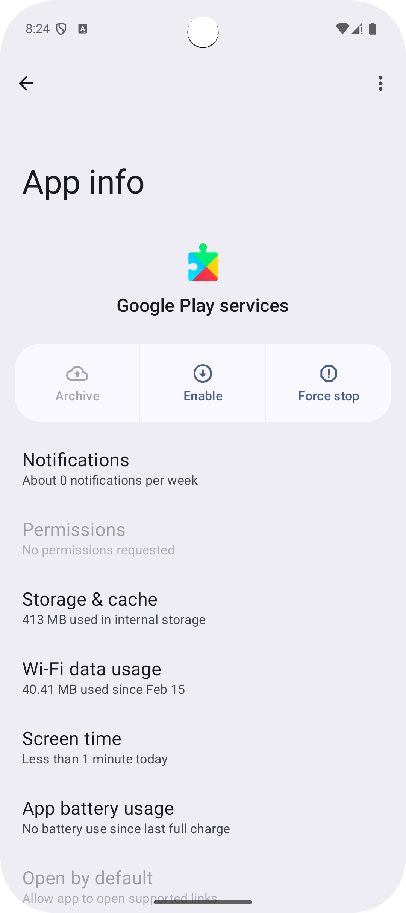

# overview
Accurate time is crucial for a wide variety of app functionalities, from scheduling and event management to transaction logging and security protocols. However, a user can change the device’s time, so a more accurate source of time than the device’s local system time may be required. That's why we're introducing the TrustedTime API that leverages Google's infrastructure to deliver a trustworthy timestamp, independent of the device's potentially manipulated local time settings.

TrustedTime periodically syncs its clock to Google's servers, which have access to a highly accurate time source, so that you do not need to make a server request every time you want to know the current network time. 

# dev memo
If you use Dagger Hilt to handle an instance of Task in ApplicationScope, ensure that Google Play Service is up to date when the app starts. If Google Play Service is disabled or otherwise unavailable at startup, it is safe to have the mechanism that displays a dialog prompting the user to update. 

Based on the above, I think it is a good idea to use Dagger Hilt to handle an instance of Task<TrustedTimeClient> in ActivityScope.

In that case, it is easy to handle if you call it in Coroutine as needed in the Activity you are using, as in the code below.
[https://github.com/LeoAndo/android-trustedtime-samples/blob/main/ComposeSample/app/src/main/java/com/example/composesample/MainActivity.kt#L70-L97](https://github.com/LeoAndo/android-trustedtime-samples/blob/main/ComposeSample2/app/src/main/java/com/example/composesample/MainActivity.kt#L78-L105)

# Android Studio
```
Android Studio Meerkat Feature Drop | 2024.3.2 Nightly 2025-02-14
```
# cording flow
https://github.com/LeoAndo/android-trustedtime-samples/pull/1<br>
https://github.com/LeoAndo/android-trustedtime-samples/pull/3<br>
https://github.com/LeoAndo/android-trustedtime-samples/pull/5<br>

# cording flow: Handling Google Play Services Version Updates in App
https://github.com/LeoAndo/android-trustedtime-samples/commit/5ffc42b56d0cef5b012ace8f80ea387126f3b6bd

# capture: Pixel 9 Pro Fold API Baklava Preview

| java | kotlin | compose |
|:---|:---:|:---:|
| | | |

| 1 | 2 |
|:---|:---:|
| | |

# refs
https://android-developers.googleblog.com/2025/02/trustedtime-api-introducing-reliable-approach-to-time-keeping-for-apps.html
