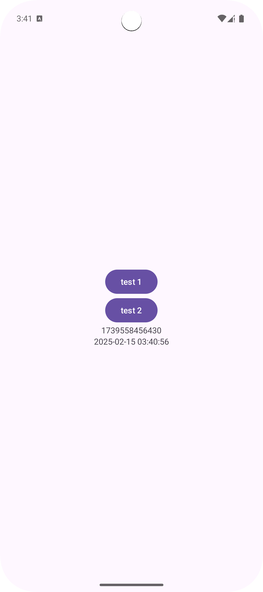
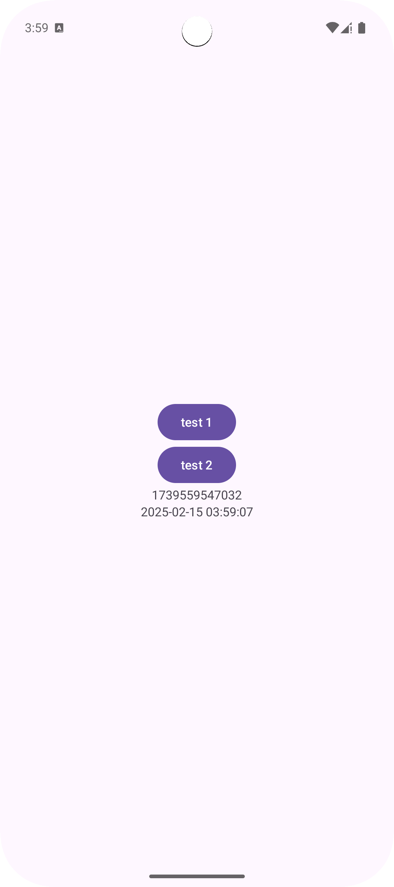
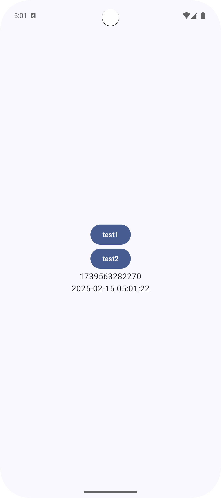

# overview
Accurate time is crucial for a wide variety of app functionalities, from scheduling and event management to transaction logging and security protocols. However, a user can change the device’s time, so a more accurate source of time than the device’s local system time may be required. That's why we're introducing the TrustedTime API that leverages Google's infrastructure to deliver a trustworthy timestamp, independent of the device's potentially manipulated local time settings.

TrustedTime periodically syncs its clock to Google's servers, which have access to a highly accurate time source, so that you do not need to make a server request every time you want to know the current network time. 

# Android Studio
```
Android Studio Meerkat Feature Drop | 2024.3.2 Nightly 2025-02-14
```
# cording flow
https://github.com/LeoAndo/android-trustedtime-samples/pull/1<br>
https://github.com/LeoAndo/android-trustedtime-samples/pull/3<br>
https://github.com/LeoAndo/android-trustedtime-samples/pull/5<br>

# capture: Pixel 9 Pro Fold API Baklava Preview

| java | kotlin | compose |
|:---|:---:|:---:|
| | | |

# refs
https://android-developers.googleblog.com/2025/02/trustedtime-api-introducing-reliable-approach-to-time-keeping-for-apps.html
